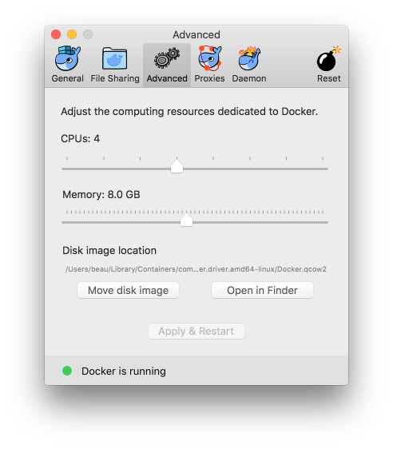

# How to preprocess data with fmriprep

[fmriprep](https://github.com/poldracklab/fmriprep) is a tool for running a standard, minimal fMRI preprocessing pipeline. The [fmriprep documentation](http://fmriprep.readthedocs.io/) describes its [preprocessing pipeline](http://fmriprep.readthedocs.io/en/stable/workflows.html), which the developers say will be regularly updated to follow best practices in the field.

fmriprep is relatively easy to install and use, but it depends on a software container platform called [Docker](https://www.docker.com/), which must be installed and configured before using fmriprep.

## Installing Docker

1. Install Docker. Most people should download and install [Docker Community Edition](https://www.docker.com/community-edition#/download).
2. By default, Docker only uses 2GB of RAM, which is not enough for fMRI preprocessing. Open Docker and adjust the amount of RAM and number of CPUs to use in its preferences (your desired values will vary depending on how many CPUs and how much RAM you have on your computer). 

## Installing fmriprep

1. In your terminal, run `docker pull poldracklab/fmriprep`. This will download the fmriprep docker container, which is approximately 10GB.

## Running fmriprep

1. Verify that your dataset is structured according to the [Brain Imaging Data Structure (BIDS) standard](http://bids.neuroimaging.io/). If you have the BIDS validator installed locally, you can run `bids-validator my_bids_dataset`. Otherwise you can use [the browser-based BIDS validator](http://incf.github.io/bids-validator/) (this method runs locally in the browser, and does not upload any information about your data). If the BIDS validator returns any error messages, you probably want to fix your dataset before running fmriprep.
2. Run the following in your terminal, substituting the appropriate file paths on lines 2 and 3. Note that the paths to your BIDS dataset and output directories must be absolute. This will run the full fmriprep pipeline with the default settings. If you want to different options, consult [the fmriprep documentation](http://fmriprep.readthedocs.io/).
```
docker run -ti --rm \
    -v /absolute/filepath/to/data/dir:/data:ro \
    -v /absolute/filepath/to/output/dir:/out \
    poldracklab/fmriprep:latest \
    /data /out/out \
    participant
```

## Lucky bonus pro-tips

fmriprep computes a variety of confound regressors for use later in your pipeline. There is no firm consensus on which set of regressors is best to use, but Chris Gorgolewski (an fmriprep developer) recommends including 6 motion parameters, FD, and aCompCor on run level and mean FD on group level, for both task and rest. (Info courtesy of [Matteo Visconti di Oleggio Castello](http://www.mvdoc.me/) who [asked about this on NeuroStars](https://neurostars.org/t/confounds-from-fmriprep-which-one-would-you-use-for-glm/326)).
